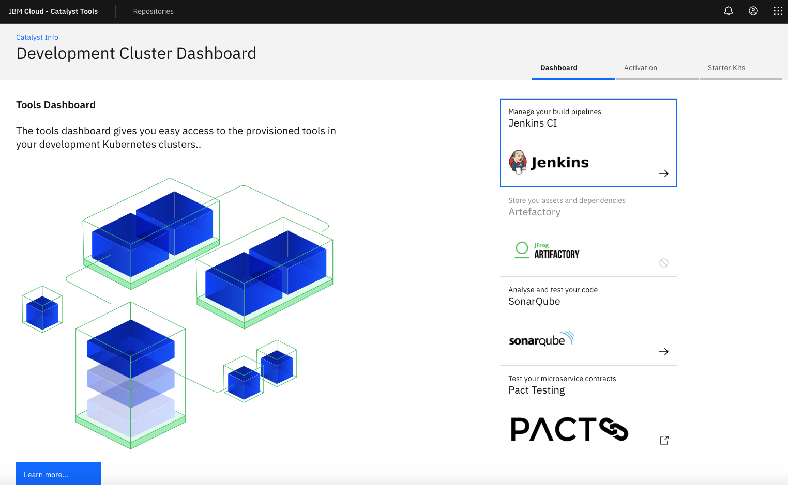

# IBM Cloud Garage
## Iteration Zero Terraform 
This repository contains tools and terraform infrastructure as code (IasC) to help setup an IBM Cloud Public development
environment ready for cloud native application development with IBM Cloud Kubernetes service. 

### Overview

This repo contains Terraform resources that will deploy the following development tools into your Kubernetes infrastructure:

- IBM Container Service Cluster (3 nodes)
- Create *dev*,*test*,*prod* and *tools* namespaces
- Install the following tools:
  - [SonarQube](https://www.sonarqube.org/) 
  - [Jenkins](https://jenkins.io/)
  - [Pack Broker](https://docs.pact.io/)
  - [Artefactory*](https://jfrog.com/open-source/)
  - [Hashi Corp Vault*](https://www.vaultproject.io/)
- Create and bind the following Cloud Services to your Cluster:
  - [AppID Application Authentication](https://cloud.ibm.com/docs/services/appid?topic=appid-service-access-management) 
  - [Cloudant NoSQL Database](https://cloud.ibm.com/docs/services/Cloudant?topic=cloudant-getting-started)
  - [Cloud Object Storage Storage](https://cloud.ibm.com/docs/services/cloud-object-storage?topic=cloud-object-storage-getting-started)
  - [LogDNA Logging](https://cloud.ibm.com/docs/services/Log-Analysis-with-LogDNA?topic=LogDNA-getting-started)
  - [SysDig Monitoring](https://cloud.ibm.com/docs/services/Monitoring-with-Sysdig?topic=Sysdig-getting-started)
  - [PostgreSQL](https://cloud.ibm.com/docs/services/databases-for-postgresql?topic=databases-for-postgresql-about)

**Warning: The material contained in this repository has not been thoroughly tested. Proceed with caution.**

## Basic Setup
This section will guide you through basic setup of the environment deployment. You will need access an account with the 
ability to provision on IBM Cloud Public before proceeding.

### Pre-requisites
The following pre-requisties are required before following the setup instructions. 

- An IBM Cloud account with the ability to provision resources to support Kubernetes environment
- A IBM Cloud [Resource Group](https://cloud.ibm.com/account/resource-groups) for you development resources
- Public VLAN, and Private VLAN in IBM Cloud
- [Docker Desktop](https://www.docker.com/products/docker-desktop) installed and running on your local machine
- [Node](https://nodejs.org/en/) installed on your local machine

**Warning: This has only been tested on MacOS.**

### Creating Resource Group
The first step is to create a dedicated Resource Group for your development team. This Resource Group will contain your 
development cluster and supporting cloud services. Using the Cloud Console create a unique 
[Resource Group](https://cloud.ibm.com/account/resource-groups). 

### Getting API Keys

The IasC requires two API Keys from the platform to enable it to provision the necessary resources. The first Key is 
for the  IBM Cloud resources and the second key is for Classic IaaS Infrastructure resources.

To generate these keys, please visit the following links:
- [IBM Cloud API Key](https://console.bluemix.net/docs/iam/userid_keys.html#creating-an-api-key "Creating an API key")
- [Classic IaaS Infrastructure Username and API Key](https://cloud.ibm.com/docs/iam?topic=iam-classic_keys#classic_keys "Managing classic infrastructure API keys")

The IBM Cloud API Key will later be referred to as: `IBMCLOUD_API_KEY`. The Classic IaaS Infrastructure Key will later 
be referred to as: `CLASSIC_API_KEY` and the Classic IaaS Infrastructure username for that Infrastructure Key is 
`CLASSIC_USERNAME`.

**Note:** To access or create the keys click on `Manage->Access(IAM>)`  Then select `IBM Cloud API keys` menu. If you do not have the Classic API key configured you will have a button at the top asking you to add them. 


Click on `Create a classic infrastructure API Key` close the dialog and then click on the `Details` menu for the classic key in the list. If this button does not appear then the key is already created for you account and just view the `Details` for this key.


You can cut and paste the `API user name` and use this for the `CLASSIC_USERNAME` and click on the `Copy` button and paste this value `CLASSIC_API_KEY`

Final part is create an  `Create an IBM Cloud API Key` Enter a name and description. Once it is created save the value and use it for `IBMCLOUD_API_KEY`


## Deploying with Terraform
This section discusses deploying IBM Cloud resources with Terraform. This section uses the [Garage Catalyst Docker Image](https://hub.docker.com/r/garagecatalyst/ibm-kube-terraform) to run the Terraform client.

### Getting Started

Once you have followed the steps in the [Basic Setup](#basic-setup) section, clone this repository to your local filesystem and cd into the src/ directory.

```bash
$ git clone git@github.ibm.com:garage-catalyst/iteration-zero-terraform.git

$ cd iteration-zero-terraform
```

Next, copy `credentials.template` to a file called `credentials.properties` then edit the `credentials.json` file and update the values for the following keys `ibmcloud.api.key`, `classic.username` and `classic.api.key`. Use the values you created from the Getting API Keys section mentioned above. Save the file. This file will also be ignored in git.

```properties
classic.username=<CLASSIC_USERNAME>
classic.api.key=<CLASSIC_API_KEY>
ibmcloud.api.key=<IBMCLOUD_API_KEY>
```

Then, run the following command to launch a Garage [Catalyst CLI Tools Docker container](https://github.ibm.com/garage-catalyst/client-tools-image).
```bash
./launch.sh
```

***NOTE:*** This will install the Cloud Garage Tools docker image and exec shell into the running container. You will run the rest of the commands from inside this container. The container will mount the `./terraform/` directory as `/home/devops/src/`. This is helpful in sharing files between your host filesystem and your container. 

It will also allow you to continue to extend or modify the base Terraform IasC supplied and tailor it for you specific project needs.

The tools docker image contains the following tools that will help you with cloud native development. 

 * terraform (with helm, kube, and ibm provider plugins)
 * calicoctl
 * ibmcloud (with container-service, container-registry, and cloud-databases plugins)
 * kubectl
 * helm
 * docker
 * git
 * nvm
 * node (v11.12.0 currently installed)
 * yo

### Deploying the Iteration Zero resources

Inside the running container, you should find the Terraform parameters file as `/home/devops/src/workspace/terraform.tfvars`. Open this file for edit and fill out the parameters with appropriate values.
```bash
$ vi /home/devops/src/settings/terraform.tfvars
```

#### Instructions for obtaining VLAN information

For example, we have a resource group `catalyst-team` with private VLAN `2372`, public VLAN `1849` in the DAL10 datacenter. Our `terraform.tfvars` would look accordingly:
```terraform
resource_group_name           = "catalyst-team"
private_vlan_number           = "2372"
private_vlan_router_hostname  = "bcr01a.dal10"
public_vlan_number            = "1849"
public_vlan_router_hostname   = "fcr01a.dal10"
vlan_datacenter               = "dal10"
vlan_region                   = "us-south"
```

You can create you public and private VLANs by accessing the `Classic Infrastructure` and then selecting `Network > IP Management > VLANs` once you have updated your values you can moved to the next step.

Save the file, then run the following commands:
```bash
$ cd src/workspace
$ chmod +x runTerraform.sh
$ ./runTerraform.sh
```
This will start the Terraform Apply process and and begin to create the infrastructure and services for your Development Enviroment.

The resources will take about 2 hours to deploy. At the end, you should have your Iteration Zero resources fully provisioned and configured!

### Development Cluster Dashboard

To make it easy to navigate to the installed tools, there is a simple dashboard that has been deployed that can help you navigate to the consoles for each of the tools.

To access the dashboard take the the ingress subdomain from the Cluster and prefix it with the word `dashboard`. 

```bash
https://dashboard.catalyst-dev-cluster.us-south.containers.appdomain.cloud

````
This will present you with the following dashboard.



### Deploying Code into Pipelines

Now you have a working development environment on the IBM Public Cloud. You can now starting working with code to deploy them into pipelines. The following instructions help describe this process.

[Jenkins Pipeline Creation Instructions](./docs/JENKINS.md)

### Destroying
Once your development tools are configured Terraform stores the state of the creation in the `workspace` folder. 

It is is possible to destory the development environment following these steps.

Run the following command to launch a Garage Catalyst CLI Tools Docker container.
```bash
./start.sh
```
from the default directory run the following command
```bash
terraform destroy
```
This will remove the development cluster and all the services that were created previously.


