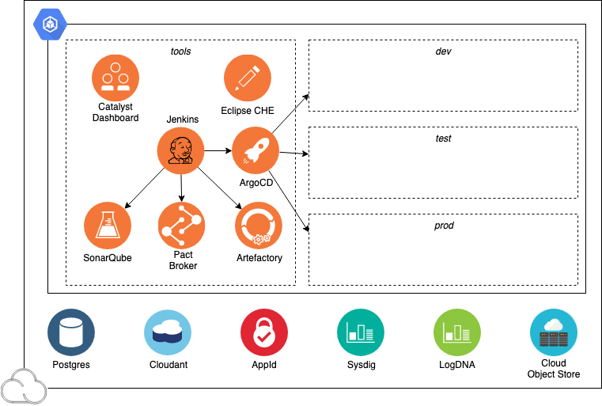

# IBM Garage for Cloud & Solution Engineering
## Iteration Zero for IBM Cloud

This repository contains infrastructure as code (IasC) scripting to create an IBM Garage Clout Native Toolkit development  environment ready for cloud-native application development with IBM Cloud Kubernetes Service or Red Hat OpenShift. 

### Overview

Iteration Zero creates an IBM Garage Cloud Native Toolkit environment in IBM Cloud, complete with tools and services needed for continious delivery of typical cloud-native applications to a [IBM Cloud Kubernetes Service](https://cloud.ibm.com/docs/containers) or [Red Hat OpenShift on IBM Cloud](https://cloud.ibm.com/docs/openshift) cluster. Typically a squad lead or lead developer would create this environment after the initial inception workshop has completed and the development team is ready to write code.

The objective of this environment is to reduce the amount of time and effort a team needs to spend creating and configuring their Kubernetes or OpenShift development environments. Rather than the team having to reinvent the wheel deciding how to set up a continious development environment and perform the manual effort to create, install, and configure the cluster, tools, and services, these infrastructure as code (IasC) scripts automate the process to consistently create an environment as needed that embodies these best practices. The scripts are modular so tools can be easily disabled or added. This combindation of tools are proven in the industry to deliver real value for modern cloud-native development. 

The Red Hat [Open Innovation Labs](https://github.com/rht-labs/labs-ci-cd) has a very similar approach to how they deliver success with OpenShift.

You can jump straight to the [Developers Guide](https://ibm-garage-cloud.github.io/ibm-garage-developer-guide/) if you want more detail on how the Cloud Native Toolkit fits into the end-to-end development story.

This repo contains Terraform resources that will create an environment containing the following development tools:
- IBM Container Service cluster (3 nodes) for Kubernetes or OpenShift
- Namespaces for *dev*, *test*, *staging*, and *tools*
- Tools for continuous delivery:
    - [Tekton CI](https://github.com/tektoncd/pipeline)
    - [Jenkins CI](https://jenkins.io/)
    - [Argo CD](https://argoproj.github.io/argo-cd/)
    - [SonarQube](https://www.sonarqube.org/) 
    - [Pact Broker](https://docs.pact.io/)
    - [Artifactory](https://jfrog.com/open-source/)
    - [Swagger Editor](https://editor.swagger.io/)
    - [Eclipse Che](https://www.eclipse.org/che/)
-  Cloud services for cloud-native applications:
    - [AppID Application Authentication](https://cloud.ibm.com/docs/services/appid) 
    - [Cloudant NoSQL Database](https://cloud.ibm.com/docs/services/Cloudant)
    - [Cloud Object Storage Storage](https://cloud.ibm.com/docs/services/cloud-object-storage)
    - [LogDNA Logging](https://cloud.ibm.com/docs/services/Log-Analysis-with-LogDNA)
    - [SysDig Monitoring](https://cloud.ibm.com/docs/services/Monitoring-with-Sysdig)
    - [PostgreSQL](https://cloud.ibm.com/docs/services/databases-for-postgresql) (used by SonarQube)

## Developer Tools

This diagram illustrates the components in a Cloud Native Toolkit environment:

## Developer Guide

[Developer Guide](https://ibm-garage-cloud.github.io/ibm-garage-developer-guide/) explains how to use the Cloud Native Toolkit environment.
Use it to deep dive into how to use these tools and programming models to make yourself productive with Kubernetes and OpenShift on the IBM Cloud.

### Install and Configure

Start with the [installation instructions](https://ibm-garage-cloud.github.io/ibm-garage-developer-guide/getting-started/overview) for creating the Cloud Native Toolkit environment. It contains the instructions for how to setup and run the Terraform Infrastructure as Code scripts in this repo.

### Developer Dashboard

[Developer Dashboard](https://ibm-garage-cloud.github.io/ibm-garage-developer-guide/getting-started/dashboard/)
explains how to open the dashbard for using the Cloud Developer Tools environment.

### Destroying

The scripts that created the Cloud Developer Tools environment can also be used to destroy it. See [destroy](https://ibm-garage-cloud.github.io/ibm-garage-developer-guide/getting-started/destroying/) for instructions.

## Summary

We are working to make Kubernetes and OpenShift development as easy as possible this toolkit adds what feels like a PaaS layer to a Kubernetes environment, any feedback on the use of the project will be most welcome.

Thanks IBM Garage Team

