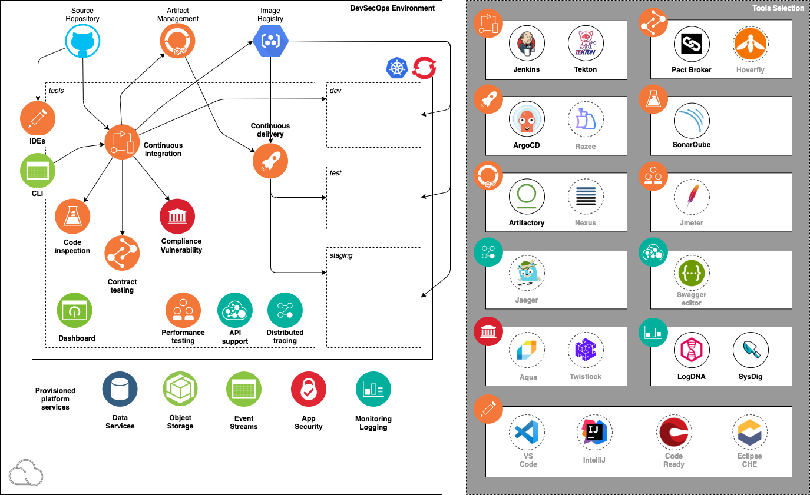

# IBM Garage Solution Engineering

## Iteration Zero for IBM Cloud

This repository contains infrastructure as code (IasC) scripting to create an IBM Garage Clout Native Toolkit 
development environment ready for cloud-native application development with IBM Cloud Kubernetes Service or 
Red Hat OpenShift. 

### Overview

Iteration Zero creates an IBM Garage Cloud-Native Toolkit environment in IBM Cloud, complete with tools and services 
needed for continious delivery of typical cloud-native applications to a 
[IBM Cloud Kubernetes Service](https://cloud.ibm.com/docs/containers) or 
[Red Hat OpenShift on IBM Cloud](https://cloud.ibm.com/docs/openshift) cluster. Typically, a squad lead or 
Site Reliability Engineer (SRE) would create this environment after the toolchain has been decided upon (often during
the Inception workshop) and before development team is ready to write code (when Iteration One has started).

The objective of this environment is to reduce the amount of time and effort a team needs to spend creating and 
configuring their Kubernetes or OpenShift development environments. Rather than the team having to re-invent the wheel 
deciding how to set up a DevOps environment and performing the manual effort to create, install, and configure the cluster,
tools, and services, these Infrastructure-as-Code (IasC) scripts automate the process to consistently create an 
environment as needed that embodies these best practices. The scripts are modular so tools can be easily added or removed.
This combination of tools have been proven in the industry to deliver real value for modern cloud-native development. 

The Red Hat [Open Innovation Labs](https://github.com/rht-labs/labs-ci-cd) has a very similar approach to how they 
deliver success with OpenShift.

You can jump straight to the [Developers Guide](https://cloudnativetoolkit.dev/) if you 
want more detail on how the Cloud-Native Toolkit fits into the end-to-end development story.

This repo contains Terraform resources that will create an environment containing the following development tools:

- IBM Container Service cluster (3 nodes) for Kubernetes or OpenShift
- Namespaces for `tools` and `ibm-observe`
- Tools for continuous delivery:
    - [Tekton CI](https://github.com/tektoncd/pipeline)
    - [Jenkins CI](https://jenkins.io/)
    - [Argo CD](https://argoproj.github.io/projects/argo-cd)
    - [SonarQube](https://www.sonarqube.org/) 
    - [Pact Broker](https://docs.pact.io/)
    - [Artifactory](https://jfrog.com/open-source/)
    - [Swagger Editor](https://editor.swagger.io/)
    - [Jaeger](https://https://www.jaegertracing.io/)
-  Cloud services for cloud-native applications:
    - Installed by default:
       - [LogDNA Logging](https://cloud.ibm.com/docs/services/Log-Analysis-with-LogDNA)
       - [SysDig Monitoring](https://cloud.ibm.com/docs/services/Monitoring-with-Sysdig)
    - Optional (move terraform file from `catalog` to the `stages` directory):
       - [AppID Application Authentication](https://cloud.ibm.com/docs/services/appid) 
       - [Cloud Object Storage Storage](https://cloud.ibm.com/docs/services/cloud-object-storage)
       - [Cloudant NoSQL Database](https://cloud.ibm.com/docs/services/Cloudant)
       - [PostgreSQL](https://cloud.ibm.com/docs/services/databases-for-postgresql)

The stages provided in this repository provide the configuration for a set of terraform modules that have been
provided as part of the Cloud-Native Toolkit. A full listing of those modules can be found in the 
[Garage Terraform Modules](https://github.com/ibm-garage-cloud/garage-terraform-modules) repository. In addition to the
modules provided with the Cloud-Native Toolkit, any Terraform modules or scripts can be incorporated into the 
Iteration Zero installation configuration.

## Developer Tools

This diagram illustrates the components in a Cloud-Native Toolkit environment:

> Artifactory is an Open Source product maintained by [JFrog](https://jfrog.com/brand-guidelines/)
>  
> Jenkins is an Open Source project [Jenkins](https://www.jenkins.io/artwork/)
>
> SonarQube is an Open Source project maintained by [SonarSource](https://www.sonarsource.com/logos/)
>
> Nexus Repository is an Open Source project maintained by [SonaType](https://www.sonatype.com/nexus-repository-oss)
>
> Trivy is an Open Source project maintained by [Aqua](https://www.aquasec.com/brand/)
>
> InteliJ is a IDE from [JetBrains](https://www.jetbrains.com/company/brand/) 
>
> VSCode is a free IDE maintained by [Microsoft](https://code.visualstudio.com/)
>
> Jaeger is an Open Source tool maintained by [Jaeger Community](https://www.jaegertracing.io/get-in-touch/)
>
> ArgoCD is an Open Source tool maintained by [ArgoCD Community](https://argoproj.github.io/projects/argo-cd/)
> 
> OpenShift and CodeReady Workspaces are products from [Red Hat](https://developers.redhat.com/products/codeready-workspaces/overview)
>
> LogDNA is an IBM Cloud service supplied by [LogDNA](https://logdna.com/)
>
> Sysdig is an IBM Cloud service supplied by [Sysdig](https://sysdig.com/)

## Developer Guide

[Developer Guide](https://cloudnativetoolkit.dev/) explains how to use the Cloud-Native Toolkit environment.
Use it to deep dive into how to use these tools and programming models to make yourself productive with Kubernetes and 
OpenShift on the IBM Cloud.

### Install and Configure

Start with the [installation instructions](https://cloudnativetoolkit.dev/getting-started/overview) for creating the 
Cloud-Native Toolkit environment. It contains the instructions for how to setup and run the Terraform Infrastructure as Code scripts in this repo.

You can install this collection of CNCF DevSecOps tools using the [IBM Cloud Private Catalog feature](https://cloud.ibm.com/docs/account?topic=account-manage-catalog) more information on 
how to configure an IBM Cloud Private Catalog tile and complete an installation can be found in this 
[README](.tile/tiles/cloudnative-toolkit) or documentation in the [Developer Guide](https://cloudnativetoolkit.dev/admin/installation-private-catalog)

### Developer Dashboard

[Developer Dashboard](https://ibm-garage-cloud.github.io/ibm-garage-developer-guide/getting-started/dashboard/)
explains how to open the dashbard for using the Cloud Developer Tools environment.

### Destroying

The scripts that created the Cloud Developer Tools environment can also be used to destroy it. See
[destroy](https://cloudnativetoolkit.dev/getting-started/destroying/) for instructions.

## Development

### Process

#### Create a pull request

When a pull request is created, there are a couple of categories of labels that can be used to influence the workflow
behavior.

*Verification process*

* `skip ci` - Indicates that the validation process should be skipped for the PR. This should be used sparingly but is
particularly appropriate if the change impacts a file that is inconsequential to the terraform installation process, like
the README or a shell script. The intent of this label is to speed up the process and save resources for the entire 
verification process.

*Change type*

The change type labels (`feature`, `bug`, `chore`) tell the component that generates the change log what type of change
the pull request represents.
 
* `feature` - The change introduces a new feature or enhancement for the repository
* `bug` - The change provides a fix to existing code in the repository
* `chore` - The change represents maintenance performed on the repository

*Release type*

The release type labels (`major`, `minor`, `patch`) tell the component that generates the release how to increment the 
version number

* `major` - The change should be part of a new `major` release (e.g. 2.0.0)
* `minor` - The change should be part of a new `minor` release (e.g. x.2.0)
* `patch` - The change should be part of a new `patch` release (e.g. x.y.3)

#### Squash and merge the pull request

When the pull request is validated and reviewed, squash and merge the pull request

#### Publish the release

Each change will create or contribute to a draft release on the repository. When it is time to publish the release, edit
the draft release in GitHub and click the `Publish` button. That will make the release visible outside of the development
team and trigger the `Publish assets` workflow.

### Automated workflows

The repository uses GitHub Actions to automate the steps to validate, release, and publish the assets.

#### Verify PR

When a pull request is created or a change is pushed to an existing PR, the 
[Verify PR](https://github.com/ibm-garage-cloud/ibm-garage-iteration-zero/actions?query=workflow%3A%22Verify+PR%22) 
workflow runs to execute the full Iteration Zero workflow against existing IKS, OCP3, and OCP4 clusters.
 

Labels added to the Pull Request will impact the behavior of the following `Release` workflow when the PR is merged.

#### Release

Pushing changes to the `master` branch, either by merging a PR (ideally) or by a direct push, triggers the 
[Release](https://github.com/ibm-garage-cloud/ibm-garage-iteration-zero/actions?query=workflow%3ARelease) workflow. 
The workflow *should* validate the build by running through the entire terraform process to existing cluster, 
although that has been turned off for the time being. If the verification completes successfully, the workflow creates
(or appends to) a draft release containing the changes. Each commit to the repository will be added to the draft release 
until someone manually publishes the release. 

#### Publish assets

Publishing a new release will trigger the [Publish assets](https://github.com/ibm-garage-cloud/ibm-garage-iteration-zero/actions?query=workflow%3A%22Publish+assets%22)
workflow. The workflow generates any assets that should be published with the release (currently the IBM Private Catalog tile assets)
based on the released version of the repository.

#### Create PR

The upstream terraform module repositories have been configured to trigger a `repository_dispatch` event when a new
release of the module has been published. An incoming `repository_dispatch` event triggers the [Create PR](https://github.com/ibm-garage-cloud/ibm-garage-iteration-zero/actions?query=workflow%3A%22Create+PR%22)
workflow to update the version of each module in the repository and create a Pull Request if there are any changes.

## Summary

We are working to make Kubernetes and OpenShift development as easy as possible this toolkit adds what feels like a 
PaaS layer to a Kubernetes environment, any feedback on the use of the project will be most welcome.

Thanks IBM Garage Solution Engineering

